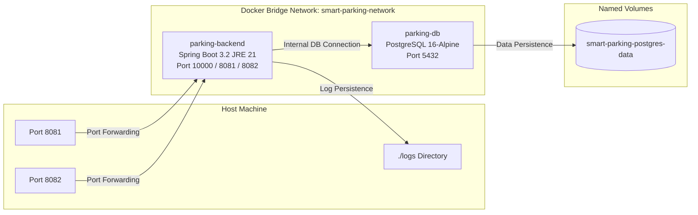

# Docker Guide - Smart Parking Management System

This guide explains the containerization architecture, configuration, and workflows for deploying the Smart Parking Management System using Docker.

---

## 🏗️ Docker Architecture

The application is structured into two main container services within a dedicated bridge network:



---

## 📦 Multi-stage Dockerfile

The system uses a multi-stage `Dockerfile` to optimize build caching, reduce runtime image size, and separate compilation tools from execution binaries.

### Build Stage
* **Base Image**: `maven:3.9.6-eclipse-temurin-21`
* **Purpose**: Fetches project dependencies and builds the fat JAR file.
* **Cache Optimization**: Copies the `pom.xml` and downloads Maven dependencies before copying the source code, preventing rebuilds of dependencies when only source code changes.

### Runtime Stage
* **Base Image**: `eclipse-temurin:21-jre`
* **Purpose**: Executes the application in a lightweight JRE environment.
* **Security Controls**:
  * Creates and runs the process under a non-root system group and user (`parking:parking`).
  * Restricts write access of directories to only necessary log folder locations.
* **JVM Tuning**:
  * `-XX:+UseContainerSupport`: Allows the JVM to respect memory limits set by the Docker engine.
  * `-XX:MaxRAMPercentage=70`: Configures the JVM to allocate a maximum of 70% of container memory to the heap.
  * `-XX:+UseG1GC -XX:+UseStringDeduplication`: Optimizes garbage collection and string memory overhead.
* **Timezone & Locale**:
  * Set to `Asia/Kolkata` (`TZ=Asia/Kolkata`).
  * Enforces UTF-8 encoding locales globally (`LANG=en_US.UTF-8`, `LC_ALL=en_US.UTF-8`).
* **Ports**:
  * Exposes port `10000` as the default application listener port (configurable via `SERVER_PORT`).
* **Health Check**:
  * Runs a `curl` query against the local Actuator health endpoint:
    `HEALTHCHECK --interval=30s --timeout=10s --start-period=90s --retries=5 CMD curl --fail http://localhost:${SERVER_PORT:-10000}/actuator/health || exit 1`

---

## 🐳 Docker Compose Orchestration

The `docker-compose.yml` file configures two services:

### 1. `parking-db`
* **Image**: `postgres:16-alpine`
* **Environment Variables**: Sets database user, password, database name, and UTF-8 encoding parameters.
* **Volumes**: Named volume `smart-parking-postgres-data` maps to `/var/lib/postgresql/data` for data persistence.
* **Ports**: Maps host port `5432` to container port `5432`.
* **Health Check**: Uses `pg_isready` to report container readiness status.

### 2. `parking-backend`
* **Build Context**: Uses the local root `Dockerfile`.
* **Dependency Controls**: Configures `depends_on` with `condition: service_healthy` to block backend startup until PostgreSQL is ready.
* **Environment Variables**: Overrides Spring Boot settings (e.g. database credentials, profile selection, listener ports).
* **Volumes**: Binds `./logs` on the host to `/app/logs` inside the container.
* **Ports**: Exposes port `8081` for the main application and `8082` for Actuator metrics.

---

## ⚙️ Environment Variables

The container configuration is managed via a `.env` file at the root.

| Environment Variable | Description |
| :--- | :--- |
| `DB_NAME` | PostgreSQL Database name (default: `smart_parking_db`). |
| `DB_USERNAME` | PostgreSQL User name (default: `postgres`). |
| `DB_PASSWORD` | PostgreSQL password. |
| `DB_PORT` | PostgreSQL external mapping port (default: `5432`). |
| `SERVER_PORT` | Application HTTP listener port (default: `8081` in compose, `10000` in container). |
| `ACTUATOR_PORT` | Actuator HTTP listener port (default: `8082`). |
| `SPRING_DATASOURCE_URL` | JDBC database URL (points to container service `jdbc:postgresql://parking-db:5432/`). |
| `UPI_MERCHANT_ID` | Production UPI merchant target. |
| `UPI_MERCHANT_NAME` | Merchant display name. |

---

## 🚀 Execution & Command Reference

Run all commands from the repository root directory.

### Build and Run Services
```bash
# Copy template env
cp .env.example .env

# Build images and start containers in detached mode
docker compose up --build -d
```

### Monitoring Containers
```bash
# Check container status and health
docker compose ps

# Follow container logs (both backend and database)
docker compose logs -f

# Check resource utilization metrics
docker stats
```

### Accessing Container Shells
```bash
# Access Backend command line
docker compose exec parking-backend bash

# Access PostgreSQL Command Line Directly
docker compose exec parking-db psql -U postgres -d smart_parking_db
```

### Stop Services
```bash
# Stop containers (preserves database data)
docker compose down

# Stop and wipe databases (WARNING: Deletes postgres volume)
docker compose down -v
```

---

## 🔧 Troubleshooting

### 1. Database Connection Failures
* **Symptom**: Backend logs display `Connection refused` or Hikari Pool startup timeout.
* **Resolution**: Verify that the database container is healthy:
  `docker compose ps`
  If database is unhealthy, check database-specific logs:
  `docker compose logs parking-db`

### 2. Port Collision Issues
* **Symptom**: Docker compose fails with `bind: address already in use` for `8081` or `5432`.
* **Resolution**: Find and terminate the process holding the port on the host machine:
  * **Windows**: `netstat -ano | findstr :8081` followed by `taskkill /PID <PID> /F`
  * **Linux/Mac**: `sudo lsof -i :8081` followed by `kill -9 <PID>`
  Or, modify the port bindings in your `.env` file and restart.

### 3. Log Folder Permissions
* **Symptom**: Container crashes with write permission errors inside `/app/logs`.
* **Resolution**: Adjust the host permissions of the local `./logs` bind mount:
  `chmod -R 777 ./logs` or `chown -R 10001:10001 ./logs`

---

## 🔒 Production Recommendations

1. **Explicit Credentials**: Never use default passwords in production. Override `DB_PASSWORD` using a secure vault or runtime environment parameters.
2. **Read-Only Root Filesystem**: Configure container security contexts with a read-only root directory, mounting only `/tmp` and `/app/logs` as writeable paths.
3. **Internal Networking**: Do not expose port `5432` of the database container to the internet. Restrict connections to the backend container within the docker bridge network.
4. **Volume Encryption**: Ensure the host filesystem path hosting Docker volumes (`/var/lib/docker/volumes/`) uses disk-level encryption.
