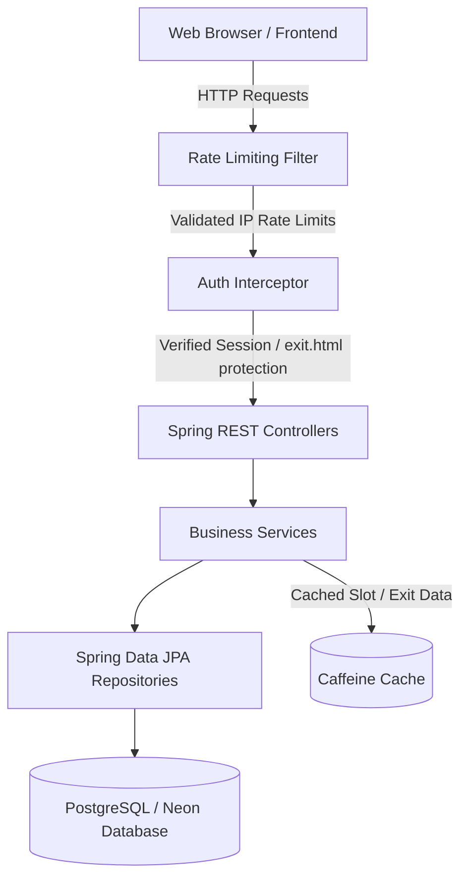

# Smart Parking Management System

[](https://openjdk.org/)
[](https://spring.io/projects/spring-boot)
[](https://www.postgresql.org/)
[](https://www.docker.com/)
[](https://flywaydb.org/)
[](LICENSE)

A robust, enterprise-grade Smart Parking Management System built with **Java 21**, **Spring Boot 3.2**, **PostgreSQL**, **Caffeine Cache**, and **Docker**. The system provides real-time multi-floor parking slot locking, booking, session-based staff authentication, and exit portal fee processing.

---

## 🔗 Live Demo
* **Production Web App URL**: `https://smartparkingsystem-lxzp.onrender.com` 

---

## 🎨 Technology Stack

### Backend
* **Language & Runtime**: Java 21 (Eclipse Temurin JDK)
* **Framework**: Spring Boot 3.2.0 (Starter Web, Actuator, Validation, Thymeleaf)
* **Data Access**: Spring Data JPA & Hibernate 6
* **Database Migration**: Flyway DB
* **Caching**: Caffeine Cache (Local In-Memory Cache)
* **API Documentation**: Springdoc OpenAPI (Swagger UI)
* **Security & Utilities**: BCrypt Password Hashing, ZXing (QR Code generation), iText Core (PDF Receipt logic)

### Frontend
* **Core Technologies**: HTML5, Vanilla CSS3 (Custom Design System with CSS variables), Vanilla JavaScript (No frameworks)
* **Real-time Synchronization**: BroadcastChannel API with localStorage fallbacks for cross-tab communication
* **UI Features**: Responsive grid layout, stationary centering modals, backdrop-blur transitions, and loading states

---

## 🏗️ System Architecture

The following diagram illustrates the application layers and data flow:



---

## 📁 Folder Structure

```
SmartParkingSystem/
├── src/
│   ├── main/
│   │   ├── java/com/smartparking/
│   │   │   ├── config/        # System configuration (WebMvc, Caffeine Cache, Passwords)
│   │   │   ├── controller/    # REST API Controllers (Auth, Parking, Exit, Health)
│   │   │   ├── dto/           # Data Transfer Objects (Requests/Responses)
│   │   │   ├── entity/        # JPA Entities (Booking, ParkingSlot, StaffUser)
│   │   │   ├── enums/         # Domain Enums (SlotStatus, VehicleType, BookingStatus)
│   │   │   ├── filter/        # HTTP Servlet Filters (Rate Limiting Filter)
│   │   │   ├── exception/     # Global & business logic exception handlers
│   │   │   ├── ratelimit/     # Token Bucket algorithm structures
│   │   │   ├── repository/    # JPA Repositories (Booking, ParkingSlot, StaffUser)
│   │   │   ├── scheduler/     # Lock cleanup schedulers
│   │   │   └── service/       # Services (Auth, Parking, Exit, Receipt, UPIPayment)
│   │   └── resources/
│   │       ├── db/migration/  # Flyway schema and seed SQL scripts
│   │       ├── static/        # Frontend pages (index.html, login.html, exit.html)
│   │       │   └── styles/    # Core styling files
│   │       ├── application.properties        # Base settings
│   │       ├── application-dev.properties     # Development settings
│   │       └── application-prod.properties    # Production settings
├── Dockerfile                 # Multi-stage Docker build configuration
├── docker-compose.yml         # Container orchestration configuration
├── pom.xml                    # Maven configuration
└── README.md                  # Project documentation
```

---

---

## 🔐 Authentication System

The system implements a **Session-based Authentication System** (no JWT state overhead) using Spring HTTP Session management.

* **Endpoints**:
  * `POST /api/auth/login` - Authenticates credentials, invalidates old sessions to prevent session fixation, and starts a secure session.
  * `POST /api/auth/logout` - Invalidates the HTTP session.
  * `GET /api/auth/me` - Resolves the current authenticated user session details.
* **Security Controls**:
  * **BCrypt Hashing**: Password hashes stored securely (`staff_users` table).
  * **AuthInterceptor**: Restricts access to all `/api/exit/**` endpoints and the `/exit.html` page to authenticated staff members.
  * **Cache Control**: Disables page caching for the Exit Portal to prevent accessing sensitive pages via browser back-buttons after logging out.

---

## 🚗 Parking Management

* **Total Slots**: **600 Slots** divided across 2 floors:
  * **Ground Floor (G)**: 300 slots (mapped to groups `AG01-AG20` through `OG01-OG20`).
  * **First Floor (F)**: 300 slots (mapped to groups `AF01-AF20` through `OF01-OF20`).
* **Temporary Locking**: Allows locking a slot for **2 minutes** (matching the frontend timer) before committing a booking.
* **Concurrency Control**: Pessimistic write locking (`@Lock(LockModeType.PESSIMISTIC_WRITE)`) at the database row level prevents race conditions and double-locking.
* **Input Validation**: Strict regex checks for vehicle numbers (`^[A-Z]{2}[0-9]{2}[A-Z]{2}[0-9]{4}$`), customer names, and 10-digit phone numbers.

---

## 🚪 Exit Management & Payment

* **Active Bookings Tracking**: Real-time display of parked vehicles and parking durations.
* **Fee Calculation**: Flat rate of **₹20.00/hour**, rounding up to the nearest hour.
* **Payment Support**:
  * **Cash**: Processed directly by staff.
  * **UPI**: Dynamically generates a UPI QR code using the ZXing library based on the target merchant UPI configuration and calculated amount. Requires validation of the last 5 digits of the transaction ID.
* **State Updates**: Releasing a vehicle sets the booking `isActive = false`, records payment details, releases the associated `ParkingSlot` back to `AVAILABLE`, and locks are cleared.

---

## 📄 Receipt Generation

Receipts are generated dynamically on demand.
* **Dual Download Modes**: Downloadable as a `.txt` file by querying either the booking ID (`/api/exit/receipt/{bookingId}`) or the booking code (`/api/exit/receipt/by-code/{bookingCode}`).
* **UTF-8 Encoding**: Explicit UTF-8 configuration prevents characters display issues across modern operating systems.
* **Fallback receipts**: Embedded frontend logic handles receipt generation if the backend is unreachable.

---

## 🗄️ Database Design

The schema contains three core tables optimized with performance indexes:

```
                  ┌─────────────────┐
                  │  PARKING_SLOTS  │
                  ├─────────────────┤
                  │ id (PK)         │
                  │ slot_number     │
                  │ floor           │
                  │ slot_id (Unique)│
                  │ status          │
                  │ lock_until      │
                  │ version         │
                  └────────┬────────┘
                           │ 1
                           │
                           │ 1..*
                  ┌────────▼────────┐        ┌─────────────────┐
                  │    BOOKINGS     │        │   STAFF_USERS   │
                  ├─────────────────┤        ├─────────────────┤
                  │ id (PK)         │        │ id (PK)         │
                  │ booking_code (U)│        │ username (U)    │
                  │ parking_slot_id │        │ password        │
                  │ vehicle_number  │        │ full_name       │
                  │ customer_name   │        │ role            │
                  │ phone_number    │        │ enabled         │
                  │ created_at      │        └─────────────────┘
                  │ booking_time    │
                  │ exit_time       │
                  │ status          │
                  │ parking_fee     │
                  │ duration_minutes│
                  │ is_active       │
                  │ payment_method  │
                  │ transaction_id  │
                  │ payment_time    │
                  └─────────────────┘
```

* **Indexes**: Created on `bookings(vehicle_number)`, `bookings(status)`, `bookings(is_active)`, `bookings(booking_code)`, and `parking_slots(status)`.

---

## 🚀 Flyway Migration System

Flyway maintains schema version control sequentially:
* **V1__Synchronize_Schema.sql**: Creates `parking_slots` and `bookings` tables, indexes, and primary foreign key constraints.
* **V2__Fix_Active_Vehicle_Constraint.sql**: Creates a partial unique index on `bookings(vehicle_number) WHERE is_active = TRUE` to prevent duplicate active bookings while allowing same-vehicle re-bookings after exit.
* **V3__Create_Staff_Users.sql**: Creates the `staff_users` table and inserts the default admin account `admin`.
* **V4__Fix_Admin_Password.sql**: Updates the default admin password to the BCrypt hash of `Admin@123`.

---

## 🐳 Docker Support

The application is completely dockerized using a multi-stage Docker build file:
* **Build Stage**: Compiles and packages source code using `maven:3.9.6-eclipse-temurin-21`.
* **Runtime Stage**: Runs using lightweight `eclipse-temurin:21-jre`.
  * Drops privileges by executing under a non-root system user `parking`.
  * Runs with default port `10000` (exposing environment overrides).
  * Automatically sets time zone to `Asia/Kolkata` and configures UTF-8 locales.
  * Embeds runtime container JVM tuning: `-XX:+UseContainerSupport -XX:MaxRAMPercentage=70 -XX:+UseG1GC -XX:+UseStringDeduplication`.

---

## ☁️ Cloud Deployment

### Neon PostgreSQL Integration
The application uses Neon Serverless PostgreSQL in production, leveraging connection pooling and SSL encryption for secure data persistence.

### Render Deployment
Deployed as a web service on Render:
* **Build Command**: `docker build` (using the multi-stage Dockerfile)
* **Port**: Binds to port `10000` via Render's routing layer.
* **Database**: Links directly to the Neon PostgreSQL instance.
* **Static Assets**: Bundled and served directly by Tomcat from Spring Boot classpath resource mappings.

---

## 📡 REST API Overview

### 🔐 Authentication
* `POST /api/auth/login` - JSON payload: `{ "username": "admin", "password": "..." }`
* `POST /api/auth/logout` - Invalidate session
* `GET /api/auth/me` - Get current session details

### 🚗 Parking Slots
* `GET /api/parking-slots` - Fetch all slot DTOs
* `GET /api/parking-slots/floor/{floor}` - Fetch slots for floor (1 or 2)
* `POST /api/parking-slots/lock/{slotId}` - Locks slot for booking
* `POST /api/parking-slots/book` - Commit booking reservation

### 🚪 Exit Management (Staff Protected)
* `GET /api/exit/active-bookings` - Fetch active bookings
* `GET /api/exit/calculate-fee/{bookingId}` - Calculate hours and fees
* `POST /api/exit/process-payment/{bookingId}` - Processes payment and completes exit
* `GET /api/exit/stats` - Fetch statistics metrics (today's exits, revenue, active count)
* `GET /api/exit/receipt/{bookingId}` - Download receipt text file
* `GET /api/exit/receipt/by-code/{bookingCode}` - Download receipt by booking code

---

## ⚙️ Environment Variables

Configure these variables in your `.env` file for local Docker setup or in Render/Production Settings:

| Environment Variable | Default Value | Description |
| :--- | :--- | :--- |
| `SPRING_PROFILES_ACTIVE` | `dev` | Active spring profile (`dev` or `prod`) |
| `SERVER_PORT` | `8081` | Web server listener port (defaults to `10000` in container) |
| `DB_URL` | `jdbc:postgresql://localhost:5432/smart_parking_db` | PostgreSQL connection URL |
| `DB_USERNAME` | `postgres` | Database username |
| `DB_PASSWORD` | `*******` | Database connection password |
| `CORS_ALLOWED_ORIGINS` | `http://localhost:8081` | Allowed origins configuration |
| `UPI_MERCHANT_ID` | `nandakumar27@ptyes` | Production merchant UPI ID for dynamic QR generation |
| `UPI_MERCHANT_NAME` | `Smart Parking System` | Display merchant name for UPI payments |

---

## 🛠️ Local Development Setup

### Prerequisites
* Java 21 SDK
* Maven 3.6+
* PostgreSQL 12+ running locally

### Configuration
1. Create a database named `smart_parking_db` in your PostgreSQL server.
2. Verify local credentials match those in `src/main/resources/application-dev.properties`.

### Execution
Run the following commands:
```bash
# Clone the repository
git clone <repository-url>
cd SmartParkingSystem

# Compile and start
mvn spring-boot:run
```
The application will boot on `http://localhost:8081`. 

---

## 🐳 Docker Compose Deployment

To build and run the system locally using containers:

```bash
# Copy and edit environment variables
cp .env.example .env

# Start all containers in detached mode
docker compose up --build -d

# Verify container status
docker compose ps

# View real-time logs
docker compose logs -f parking-backend
```
* Access the app at `http://localhost:8081` (database mapped locally).

---

## ⚡ Performance Optimizations
* **Eager Fetch Joins**: Essential queries in `BookingRepository` use `LEFT JOIN FETCH` or `@EntityGraph` to eagerly load mappings in a single query, resolving all N+1 query overhead and eliminating `LazyInitializationException` risks.
* **No OSIV**: Disabling Open Session in View (`spring.jpa.open-in-view=false`) prevents database connection holding during view serialization.
* **Caffeine Cache**: Caching configuration in `CacheConfig.java` caches static slot definitions to prevent redundant database hits.
* **Optimal Startup Queries**: Replaced slow table scans on startup with direct indexed count queries (`countByIsActiveTrue()`), dropping initialization from 130s to milliseconds.

---

## 🔒 Security Features
* **Rate Limiting**: Custom token-bucket rate limiter (`RateLimitingFilter`) tracks IP addresses to protect key endpoints (locks, bookings, and logins) from DDoS attacks.
* **Session Protection**: Automatic session invalidation upon login/logout prevents session fixation attacks.
* **BCrypt Encoding**: Secure, salted password storage.
* **Strict CORS Rules**: Explicit allowed-origins mapping.

---

## 🧪 Testing

Execute unit and integration tests using Maven:
```bash
mvn clean test
```

---

## 📄 License
This project is licensed under the MIT License - see the LICENSE file for details.
