# 🚗 Smart Parking Management System

[](https://openjdk.org/)
[](https://spring.io/projects/spring-boot)
[](https://www.postgresql.org/)
[](https://www.docker.com/)
[](https://flywaydb.org/)
[](https://github.com/nanda6912/SmartParkingSystem/actions/workflows/ci.yml)
[](https://github.com/nanda6912/SmartParkingSystem/actions/workflows/cd.yml)
[](LICENSE)

---

### 🚀 Live Application
* **Production Web App URL**: [smartparkingsystem-lxzp.onrender.com](https://smartparkingsystem-lxzp.onrender.com) 
* **API Health Endpoint**: [smartparkingsystem-lxzp.onrender.com/actuator/health](https://smartparkingsystem-lxzp.onrender.com/actuator/health)
* **Swagger API Documentation**: [smartparkingsystem-lxzp.onrender.com/swagger-ui/index.html](https://smartparkingsystem-lxzp.onrender.com/swagger-ui/index.html)
* **GitHub Repository**: [github.com/nanda6912/SmartParkingSystem](https://github.com/nanda6912/SmartParkingSystem)

---

<p align="center">
  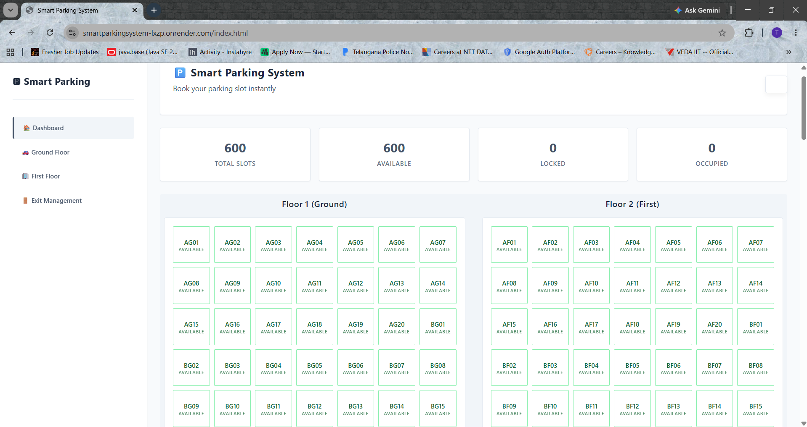
</p>

<p align="center">
  <em>A robust, enterprise-grade web application for real-time parking slot allocation, multi-floor occupancy tracking, and exit fee management.</em>
</p>

---

## 🎨 Application Gallery

| Dashboard Overview | Ground Floor Slots | First Floor Slots |
| :---: | :---: | :---: |
|  | 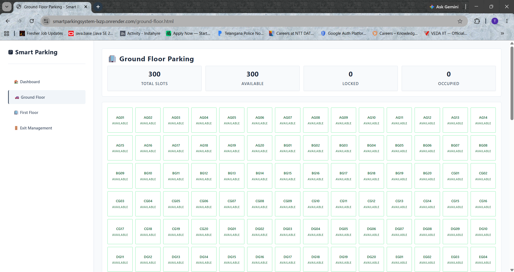 | 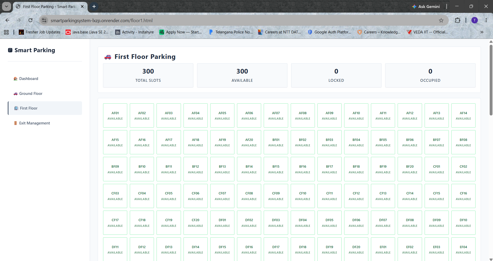 |
| **Slot Booking Dialog** | **Booking Confirmation** | **Staff Exit Login** |
| 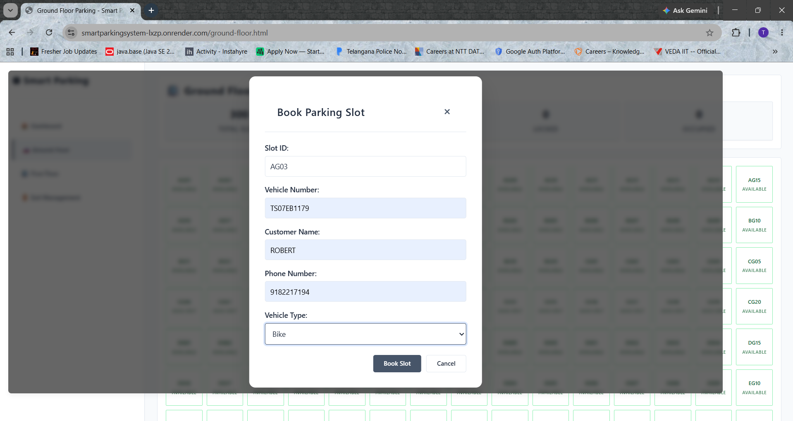 | 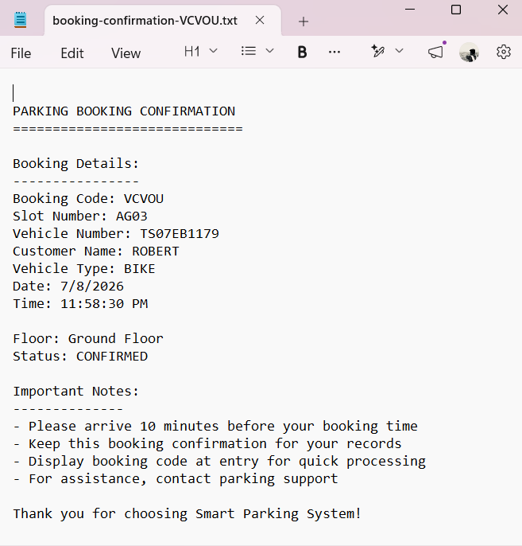 | 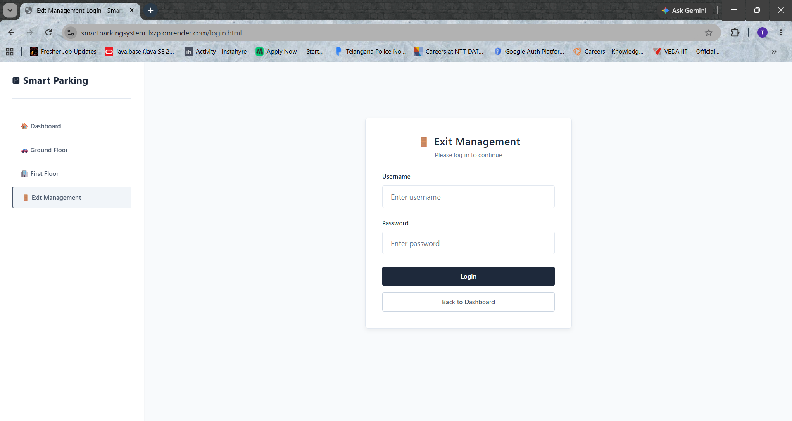 |
| **Exit Management Dashboard** | **Payment Method Selection** | **Dynamic UPI QR Code** |
| 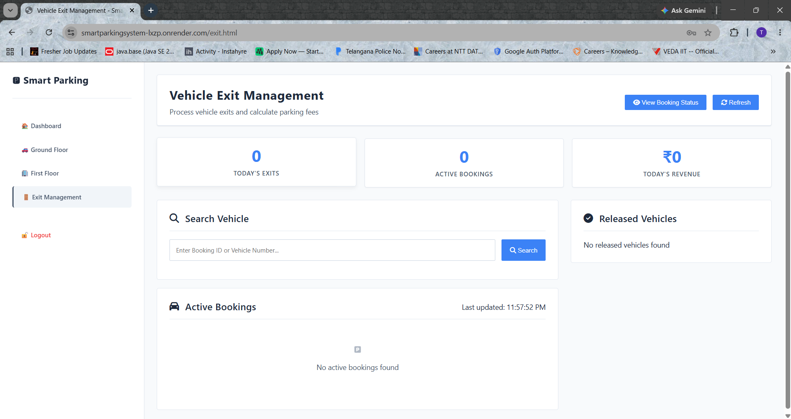 | 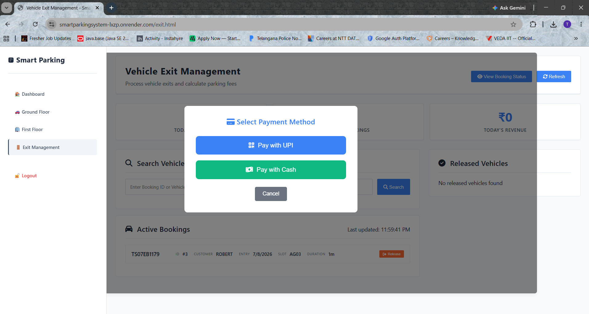 | 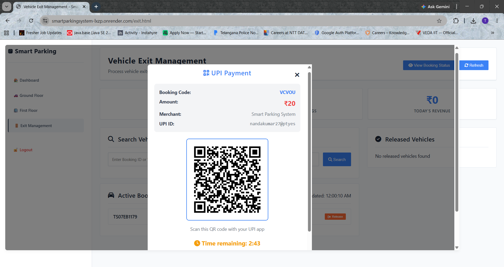 |
| **Payment Success State** | **Digital Receipt Download** | **Released Vehicles log** |
| 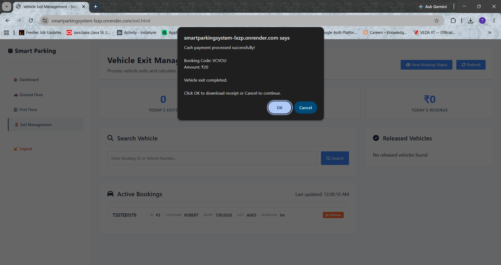 | 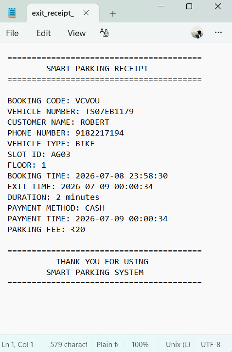 | 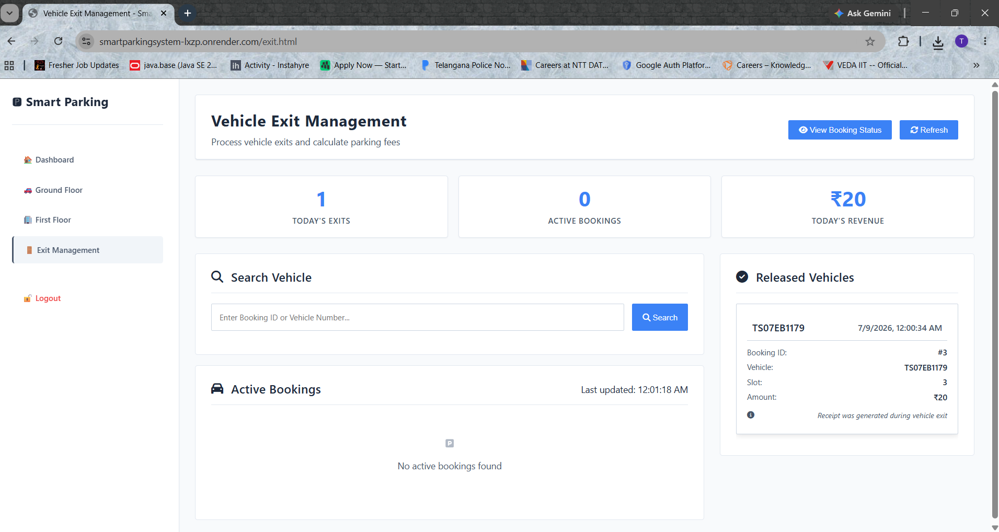 |

---

## ✨ Key Features

* 🚗 **Real-time Parking Management**: Dynamic tracking and status updates for **600 parking slots** mapped across two floors (Ground & First).
* 🔒 **Database Row Locking**: Concurrency control using row-level pessimistic write locking (`@Lock(LockModeType.PESSIMISTIC_WRITE)`) to prevent double-booking slot race conditions.
* 👤 **Staff Authentication**: Secure session-based authentication utilizing salted BCrypt hashing and custom `AuthInterceptor` route filters.
* 💳 **UPI Payment Integration**: Dynamically generated UPI payment QR codes using the ZXing library based on calculation parameters.
* 📄 **Receipt Generation**: Plain-text receipt downloadable generation with UTF-8 encoding support and client-side fallbacks.
* 🐳 **Dockerization**: Complete container orchestration via multi-stage builds and `docker-compose`.
* ☁️ **Render Cloud Deployment**: Production web hosting linked with Serverless Neon PostgreSQL database.
* 🔄 **GitHub Actions CI/CD**: Automatic compilation, testing, packaging, validation builds, and deploy webhooks.
* 📊 **Health Monitoring**: Integrated Spring Boot Actuator health polling check loops.
* ⚡ **Performance Optimizations**: Caffeine local caching, eager fetch joins, custom indexes, and disabled OSIV.

---

## 🏗️ Deployment Architecture

The following diagram illustrates the deployment topology and application data flow:

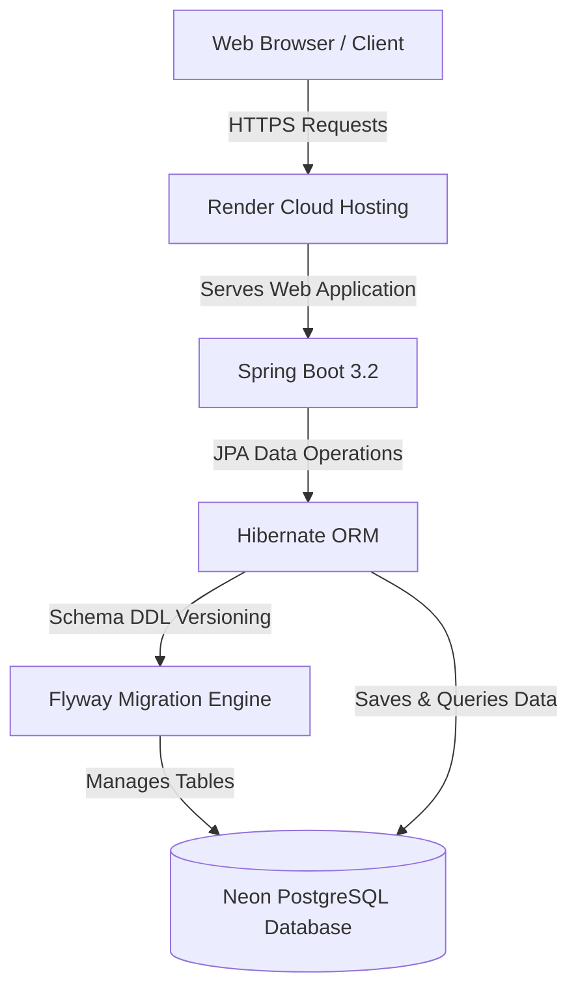

---

## 🔄 CI/CD Pipeline Flow

Our GitHub Actions workflow processes and deploys updates seamlessly:

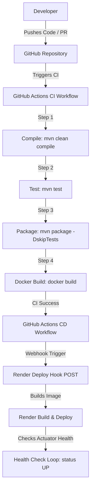

---

## 📊 Project Metrics & Tech Stack

| Component | Technology | Version / Description |
| :--- | :--- | :--- |
| **Backend Framework** | Spring Boot | 3.2.0 |
| **Language Runtime** | Java JDK | 21 (Eclipse Temurin) |
| **Database** | PostgreSQL | 16 (Neon Serverless Cloud) |
| **ORM Framework** | Hibernate / Spring Data JPA | 6.x |
| **Migration Control** | Flyway | Core Schema Migrator |
| **Cache Engine** | Caffeine Cache | Local In-Memory caching |
| **Container Engine** | Docker / Compose | Multi-Stage Build & Orchestration |
| **CI/CD Platform** | GitHub Actions | Workflows for automated CI & CD |
| **Authentication** | Spring HTTP Session | Stateful Cookie-based Auth |
| **Security Cryptography**| BCrypt | Salted password encoding |
| **UI Presentation** | HTML5 / CSS3 / Vanilla JS | Responsive custom stylesheet grid |

---

## 📁 Project Structure

```
SmartParkingSystem/
├── .github/
│   └── workflows/          # GitHub Actions CI/CD workflow definitions (ci.yml, cd.yml)
├── docs/
│   └── images/             # Application screenshots for gallery and documentation
├── src/
│   ├── main/
│   │   ├── java/com/smartparking/
│   │   │   ├── config/     # System configuration (WebMvcConfig, CacheConfig, PasswordConfig)
│   │   │   ├── controller/ # REST Controllers (AuthController, ParkingController, ExitController)
│   │   │   ├── dto/        # DTOs (BookingRequestDTO, BookingResponseDTO, LoginRequest, etc.)
│   │   │   ├── entity/     # JPA Entities (ParkingSlot, Booking, StaffUser)
│   │   │   ├── enums/      # Enums (SlotStatus, VehicleType, BookingStatus)
│   │   │   ├── exception/  # GlobalExceptionController and custom exceptions
│   │   │   ├── filter/     # HTTP Servlet Filters (RateLimitingFilter, AuthInterceptor)
│   │   │   ├── ratelimit/  # Token bucket implementation details
│   │   │   ├── repository/ # Spring Data JPA Repositories
│   │   │   ├── scheduler/  # Schedulers (LockReleaseScheduler)
│   │   │   └── service/    # Services (AuthService, ParkingService, ExitService, UPIPaymentService, etc.)
│   │   └── resources/
│   │       ├── db/migration/ # Flyway database migration scripts
│   │       ├── static/     # Static front-end pages (index.html, login.html, exit.html)
│   │       │   └── styles/ # Frontend custom stylesheet design systems
│   │       ├── application.properties        # Base Spring configuration template
│   │       ├── application-dev.properties     # Development profile configuration
│   │       └── application-prod.properties    # Production profile configuration
│   └── test/               # JUnit 5 test classes (AuthControllerTest, ParkingControllerTest)
├── Dockerfile              # Multi-stage Docker build configuration
├── docker-compose.yml      # Docker Compose local orchestration definition
├── pom.xml                 # Maven project configuration file
└── README.md               # Main project documentation
```

---

## 🛠️ Local Development & Quick Start

### Prerequisites
* **Java SDK**: JDK 21 installed.
* **Build Engine**: Maven 3.8+ installed.
* **Database**: Local PostgreSQL 12+ instance.

### Step-by-Step Installation

1. **Clone the Repository**
   ```bash
   git clone https://github.com/nanda6912/SmartParkingSystem.git
   cd SmartParkingSystem
   ```

2. **Configure Environment Variables**
   Create a local configuration environment file:
   ```bash
   cp .env.example .env
   ```
   Modify `.env` variables (e.g., PostgreSQL credentials, ports, and UPI details).

3. **Run with Docker Compose (Recommended)**
   Build and start container environments locally:
   ```bash
   docker compose up --build -d
   ```
   Access the application interface at `http://localhost:8081`.

4. **Run with Local Maven**
   Create a PostgreSQL database named `smart_parking_db` locally and start Spring Boot:
   ```bash
   mvn spring-boot:run
   ```
   The application will start on `http://localhost:8081`.

---

## 🔐 Security Features

The system follows industry security best practices to protect parking resources:

* **Salted BCrypt Hashing**: Password strings are hashed using the secure BCrypt password encoder before persistent database storage.
* **HTTP Session Authentication**: Employs stateful cookie session identifiers without the storage complexity of JWT. Prevents session fixation attacks by invalidating active sessions upon login.
* **Route Protection via Interceptors**: The custom `AuthInterceptor` filters access to all `/api/exit/**` endpoints and the `/exit.html` dashboard, checking for verified session tokens.
* **IP Rate Limiting**: The custom `RateLimitingFilter` applies a Token Bucket algorithm to throttle clients accessing key endpoints (logins, booking commits, slot locks) to protect against DDoS attacks.
* **Input Regex Sanitization**: Strictly validates fields such as vehicle registration codes (`^[A-Z]{2}[0-9]{2}[A-Z]{2}[0-9]{4}$`), user names, and 10-digit phone numbers.
* **SQL Injection Protection**: All data requests use parameterized queries mapped through Spring Data JPA to mitigate malicious input injection.
* **Explicit CORS Constraints**: Strictly binds allowed cross-origin access lists.

---

## ⚡ Performance Optimizations

To handle high concurrency, the application implements the following techniques:

* **Caffeine Local Cache**: Caches static metadata definitions (such as slot configurations) using Caffeine to decrease PostgreSQL resource load.
* **Eager Fetch Joins & EntityGraphs**: Preemptively resolves queries using `LEFT JOIN FETCH` or `@EntityGraph` annotations. This eliminates Hibernate N+1 query overhead and lazy loading initialization issues.
* **Disabled OSIV**: Explicitly sets `spring.jpa.open-in-view=false` to close database transactions immediately after business logic completion.
* **Direct Database Indexes**: Configures Postgres indexes on query filter columns such as `bookings(vehicle_number)`, `bookings(status)`, `bookings(is_active)`, `bookings(booking_code)`, and `parking_slots(status)`.
* **Optimized Initialization**: Replaced slow table database scans on system startup with fast, direct count query executions, dropping startup times to milliseconds.

---

## 🗄️ Database Design & Migration Control

Flyway maintains schema version control sequentially:
* **`V1__Synchronize_Schema.sql`**: Generates tables `parking_slots` and `bookings`, setting up primary/foreign key connections and query indexes.
* **`V2__Fix_Active_Vehicle_Constraint.sql`**: Creates a partial unique index on `bookings(vehicle_number) WHERE is_active = TRUE` to ensure a vehicle cannot have multiple overlapping active parking bookings.
* **`V3__Create_Staff_Users.sql`**: Configures the `staff_users` login schema.
* **`V4__Fix_Admin_Password.sql`**: Initializes the admin password (`Admin@123`) using BCrypt.

### ER Diagram & Relationships

```
                  ┌─────────────────┐
                  │  PARKING_SLOTS  │
                  ├─────────────────┤
                  │ id (PK)         │
                  │ slot_number     │
                  │ floor           │
                  │ slot_id (Unique)│
                  │ status          │
                  │ lock_until      │
                  │ version         │
                  └────────┬────────┘
                           │ 1
                           │
                           │ 1..*
                  ┌────────▼────────┐        ┌─────────────────┐
                  │    BOOKINGS     │        │   STAFF_USERS   │
                  ├─────────────────┤        ├─────────────────┤
                  │ id (PK)         │        │ id (PK)         │
                  │ booking_code (U)│        │ username (U)    │
                  │ parking_slot_id │        │ password        │
                  │ vehicle_number  │        │ full_name       │
                  │ customer_name   │        │ role            │
                  │ phone_number    │        │ enabled         │
                  │ created_at      │        └─────────────────┘
                  │ booking_time    │
                  │ exit_time       │
                  │ status          │
                  │ parking_fee     │
                  │ duration_minutes│
                  │ is_active       │
                  │ payment_method  │
                  │ transaction_id  │
                  │ payment_time    │
                  └─────────────────┘
```

---

## 📡 REST API Summary

| Method | Endpoint | Description | Auth Required |
| :--- | :--- | :--- | :---: |
| `POST` | `/api/auth/login` | Authenticate credentials and establish session | No |
| `POST` | `/api/auth/logout` | Terminate and invalidate session | No |
| `GET` | `/api/auth/me` | Fetch active user credentials | No |
| `GET` | `/api/parking-slots` | Fetch all parking slot configurations | No |
| `GET` | `/api/parking-slots/floor/{floor}` | Fetch slot configurations for a specific floor | No |
| `POST` | `/api/parking-slots/lock/{slotId}` | Lock a parking slot temporarily (2 minutes) | No |
| `POST` | `/api/parking-slots/book` | Book a locked parking slot | No |
| `GET` | `/api/exit/active-bookings` | Fetch currently active bookings | **Yes** |
| `GET` | `/api/exit/calculate-fee/{bookingId}` | Calculate parking hours and billing fees | **Yes** |
| `POST` | `/api/exit/process-payment/{bookingId}` | Process parking payment and complete release | **Yes** |
| `GET` | `/api/exit/stats` | Fetch daily revenue and vehicle counts | **Yes** |
| `GET` | `/api/exit/receipt/{bookingId}` | Download text-based invoice receipt | **Yes** |
| `GET` | `/api/exit/receipt/by-code/{bookingCode}` | Download receipt using booking code | **Yes** |

---

## 🔮 Future Enhancements

- 📧 **Automated Email Notifications**: Email digital receipts to customers immediately after check-out.
- 💬 **SMS Notifications**: Send text alerts with slot confirmation and active booking time indicators.
- 📊 **Advanced Analytics Dashboard**: Graphical reports on parking trends and revenue generation.
- 📅 **Advance Booking System**: Pre-book parking slots days ahead.
- 📱 **Native Mobile Application**: Cross-platform app for booking management.
- 📷 **License Plate Camera Scanning (ALPR)**: Automatic entry scanning.
- 🏷️ **Role-Based Access Control Expansion**: Dynamic portal roles for Staff, Operators, and Admins.

---

## 📄 License
This project is licensed under the MIT License - see the [LICENSE](file:///c:/Users/HP/Desktop/SmartParkingSystem/LICENSE) file for details.
